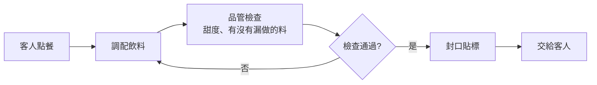

# 第 1 章:什麼是 CI/CD?

> 讀完這章,你會知道 CI/CD 到底在解決什麼問題,以及為什麼幾乎所有軟體公司都在用它。

---

## 1.1 先從一個沒有 CI/CD 的世界說起

想像一下,你和三個同學一起做一份分組報告,報告用 Google 文件一起編輯。

如果沒有版本紀錄、沒有規則,可能會發生這些事:

- 小明改了某一段,忘記跟大家說,結果小華改回舊版本,小明的努力白費了。
- 大家各自在自己電腦上寫,最後要「合併」的時候,格式全部跑掉。
- 报告交出去前,才發現某一段的數據其實是錯的,但已經來不及了。

寫程式也會遇到一模一樣的問題,而且規模更大:

- 一個 App 可能有幾十、幾百個工程師同時在修改同一份程式碼。
- 每個人改的地方,都可能不小心把別人寫好的功能弄壞。
- 如果沒有自動化的檢查機制,只能靠人工一行一行看,既慢又容易漏掉問題。

**CI/CD 就是為了解決這些問題而生的一套「自動化工作流程」。**

---

## 1.2 用「手搖飲料店」比喻 CI/CD

假設你們班在園遊會擺攤賣手搖飲,整個流程長這樣:

- **調配飲料** 就像工程師「寫程式碼」。
- **品管檢查** 就像 CI(持續整合)在做的事:自動檢查這杯飲料有沒有問題。
- **封口貼標、交給客人** 就像 CD(持續交付/部署):把檢查合格的成果,自動送到使用者手上。

如果每一杯飲料都要「老師人工簽名同意」才能封口,那動線會塞爆。
但如果你們設計了一套**標準化的自動檢查流程**,不管誰來調飲料,都會經過一樣的把關,又快又穩定。

CI/CD 做的,就是把「檢查」跟「上架」這兩件事,交給電腦自動、重複、一致地完成。

---

## 1.3 正式定義

| 縮寫 | 全名 | 白話說明 |
|------|------|----------|
| **CI** | Continuous Integration(持續整合) | 每次有人把程式碼改動「整合」進主要版本時,自動幫你建置(build)並執行測試,確保沒有把東西弄壞。 |
| **CD** | Continuous Delivery(持續交付) | CI 檢查通過後,自動把程式打包成「隨時可以上線」的狀態,但**上不上線由人決定**(通常按一個按鈕)。 |
| **CD** | Continuous Deployment(持續部署) | 比「持續交付」更進一步:檢查通過後**自動直接上線**,完全不需要人工按按鈕。 |

> 有趣的是,CD 這個縮寫其實對應兩種不同但相關的概念。後面的章節([第 4 章](./04-持續交付與持續部署CD.md))會詳細比較兩者的差異。

---

## 1.4 CI/CD 幫我們省下什麼?

1. **省時間**:不用每次都手動測試、手動上傳檔案到伺服器。
2. **減少人為疏失**:電腦不會累、不會忘記某個檢查步驟。
3. **更快發現問題**:程式碼一有問題,幾分鐘內就知道,而不是等到上線後被使用者發現。
4. **讓團隊更有信心改程式**:因為知道背後有一張自動化的安全網在檢查,大家更敢於嘗試新功能。

---

## 1.5 這份教學會怎麼教你?

接下來的章節會按照這個順序帶你理解:

1. 先補足你需要知道的 **Git 基礎知識**([第 2 章](./02-版本控制與Git基礎.md)),因為 CI/CD 都是建立在版本控制系統之上運作的。
2. 深入理解 **CI(持續整合)** 實際在做什麼([第 3 章](./03-持續整合CI.md))。
3. 深入理解 **CD(持續交付/部署)** 的概念與差異([第 4 章](./04-持續交付與持續部署CD.md))。
4. 動手認識 **GitHub Actions**(目前最多人使用的 CI/CD 工具之一),並且真的寫出一份設定檔([第 5、6 章](./05-GitHubActions入門.md))。
5. 搭配本專案裡**真的能跑的範例程式**,看測試與部署如何被自動觸發([第 7、8 章](./07-在CI中測試.md))。
6. 最後補充業界的 **最佳實踐與常見問題**([第 9、10 章](./09-最佳實踐與常見錯誤.md))。

準備好了嗎?接下來前往 [第 2 章:Git 與版本控制基礎](./02-版本控制與Git基礎.md)。
