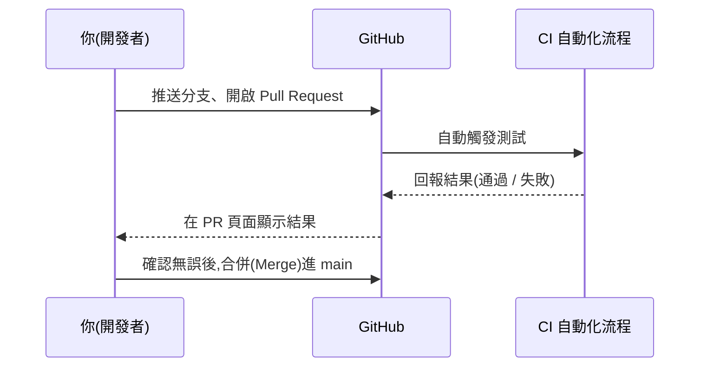

# 第 2 章:Git 與版本控制基礎

> CI/CD 是建立在「版本控制系統」之上運作的。這一章會用最少的篇幅,教你看懂後面章節需要的 Git 觀念。
> 如果你已經很熟悉 Git,可以直接跳到 [第 3 章](./03-持續整合CI.md)。

---

## 2.1 什麼是版本控制?

還記得你寫作業時,是不是常常存成這樣的檔名?

```
報告.docx
報告_修改版.docx
報告_修改版2.docx
報告_最終版.docx
報告_最終版_真的是這個.docx
```

這就是一種很陽春的「版本控制」——你想要保留每個修改階段,以防改壞了可以回頭找舊的。

**Git** 就是一套幫你自動、有系統地做這件事的工具,而且比檔名亂加字好用一百倍:

- 它會記錄「誰在什麼時候改了什麼」。
- 你可以隨時回到任何一個歷史版本。
- 多人可以同時修改同一份程式碼,之後再「合併」在一起。

**GitHub** 則是一個把 Git 專案「放到網路上」的平台,讓大家可以互相分享、協作、備份程式碼。
你可以把 Git 想成「一套規則跟工具」,GitHub 則是「一個用這套工具的公共廣場」。

---

## 2.2 三個你一定要先認識的名詞

### (1) Repository(倉庫,簡稱 repo)

一個 repo 就是「一個專案的完整資料夾 + 它所有的歷史紀錄」。
你現在看的這份教學,本身就是放在一個叫 `ci-cd-tutorial` 的 repo 裡。

### (2) Commit(提交)

一次 commit,就是「幫目前的修改拍一張快照,並寫一句話說明改了什麼」。

```bash
git add 檔案.txt          # 告訴 Git:「這個檔案的改動我要納入這次快照」
git commit -m "修正了計算機的加法錯誤"   # 正式拍下這張快照,並留言說明
```

每一個 commit 都像是遊戲中的「存檔點」——之後不管發生什麼事,你都可以讀取回這個存檔點。

### (3) Branch(分支)

Branch 讓你可以「開一條平行時空」來改程式,而不會影響到原本穩定的版本。


- `main`(有些專案叫 `master`)通常代表「目前最穩定、正式上線的版本」。
- 當你想開發新功能時,會另外開一條分支(例如 `feature-新功能`),在裡面自由修改,
  不會弄壞 `main` 分支上穩定的程式碼。
- 開發完成後,再透過 **Pull Request** 把分支「合併」回 `main`。

---

## 2.3 Pull Request(PR)是什麼?

Pull Request(簡稱 PR),白話翻譯就是:

> 「我在我的分支上改好東西了,可以請你檢查一下,確認沒問題後合併進 main 分支嗎?」

這就是 CI/CD 最常「插手」的地方!

當你開一個 PR 的時候,GitHub Actions 這類工具會**自動**:

1. 抓取你這個分支的最新程式碼。
2. 自動執行建置(build)與測試(test)。
3. 把結果(成功或失敗)顯示在 PR 頁面上,讓所有人一目了然。



這樣一來,團隊裡的任何人都不需要「口頭保證」自己的程式碼沒問題——
**Git + CI/CD 讓每一次改動都有客觀的、自動化的證據。**

---

## 2.4 一個實際的操作流程範例

以本專案的範例程式 [`examples/calculator`](../examples/calculator) 為例,一個典型的開發流程長這樣
(目前這個範例已經有加、減、乘、除四種功能,這裡假設你想再加上「次方」功能):

1. 你想幫計算機加上「次方」功能,先建立一個新分支:
   ```bash
   git checkout -b feature-次方功能
   ```
2. 修改程式碼,新增次方函式跟對應的測試。
3. 存檔並 commit:
   ```bash
   git add .
   git commit -m "新增次方功能與測試"
   ```
4. 推送到 GitHub:
   ```bash
   git push origin feature-次方功能
   ```
5. 在 GitHub 網頁上開啟 Pull Request。
6. **GitHub Actions 自動開始跑測試**(這就是 CI 上場的時刻!)。
7. 測試通過後,合併進 `main`。
8. 如果專案有設定自動部署,合併後**網站或程式會自動更新上線**(這就是 CD 上場的時刻!)。

---

## 2.5 小結

| 名詞 | 一句話記住它 |
|------|--------------|
| Repository | 專案的完整資料夾 + 歷史紀錄 |
| Commit | 一次存檔,附上說明文字 |
| Branch | 平行時空,不會弄壞主線 |
| Pull Request | 「請檢查我的修改,確認沒問題再合併」的正式申請 |
| Merge | 把分支的修改合併回主線 |

有了這些基礎,你已經具備理解 CI/CD 運作原理所需要的全部背景知識了。
接下來,前往 [第 3 章:持續整合(CI)](./03-持續整合CI.md),深入了解「自動測試」到底是怎麼運作的。
