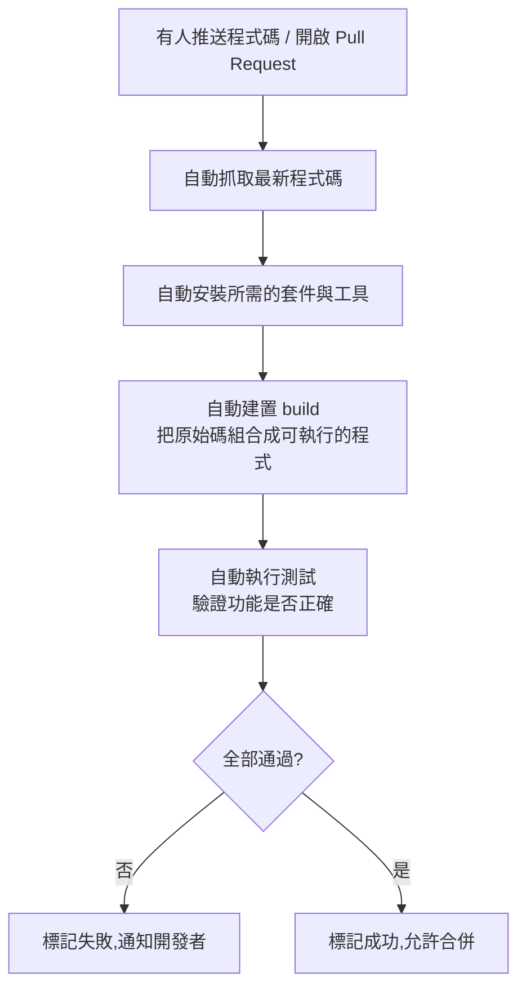

# 第 3 章:持續整合(CI)

> 這一章專注在 CI(Continuous Integration,持續整合)本身:它到底自動做了哪些事、
> 為什麼叫「整合」、以及它是怎麼幫團隊擋下問題的。

---

## 3.1 「整合」到底在整合什麼?

假設一個團隊裡有三個人,同時在修改同一個班級的成績計算系統:

- 小明在改「加分規則」。
- 小華在改「及格分數的判斷」。
- 小美在改「成績單的顯示格式」。

三個人都是在自己的分支上工作,彼此看不到對方改了什麼。
當三個人都改完,準備把自己的分支「合併」回主線的那一刻,就是「整合」發生的時刻。

問題來了:如果小明改的加分規則,剛好跟小華改的及格判斷邏輯互相衝突,
兩邊各自測試都沒問題,但合在一起後就會產生錯誤結果,例如某個學生應該及格卻被判定不及格。

如果大家都是「改完自己的部分,一個月後才一次整合」,那麼:

- 衝突會累積得又多又複雜,很難抓出問題出在哪一段修改。
- 越晚發現問題,修正的成本越高。

**持續整合的精神**就是:**不要把「合併」這件事拖到最後才做,而是頻繁地、小份量地整合,
並且每次整合都自動檢查有沒有問題。**

---

## 3.2 CI 實際上自動做了哪些事?

一個典型的 CI 流程,大致包含以下幾個自動化步驟:

逐一說明:

1. **抓取程式碼**:CI 系統會自動下載你剛剛推送的最新版本程式碼。
2. **安裝套件**:大部分程式都會依賴別人寫好的工具或函式庫,CI 會自動下載安裝這些依賴。
3. **建置(Build)**:把原始碼轉換或組合成「可以真正執行」的程式(不同語言的建置方式不同,
   有些語言像 Python、JavaScript 這種「直譯語言」建置步驟會很簡單,幾乎可以直接執行)。
4. **測試(Test)**:自動執行事先寫好的測試程式,驗證功能是否符合預期(這是 CI 裡最關鍵的一步,
   [第 7 章](./07-在CI中測試.md) 會深入示範)。
5. **回報結果**:把整個過程的結果(成功或失敗)清楚地顯示出來,讓開發者立刻知道自己的修改有沒有問題。

---

## 3.3 為什麼「頻繁」整合很重要?

用存錢的概念比喻:

- 每天存 50 元,一年後你會很清楚自己存了多少、花去哪了,帳目清楚。
- 如果每年年底才想起來要整理一整年的收支紀錄,不但麻煩,還容易漏掉、對不上帳。

程式碼的修改也是一樣。**每一次改動都小份量、都馬上檢查**,比起「累積很多修改後才一次檢查」,
出問題時更容易定位到是哪一次修改造成的。

這也是為什麼 CI 系統通常設定成:**每次推送(push)或每次開啟/更新 Pull Request 時,就自動觸發一次**。

---

## 3.4 CI 檢查失敗時,代表什麼?

CI 檢查失敗,不代表「你很糟糕」,而是代表**這套自動化安全網,正在做它該做的事**——
在問題影響到其他人或正式環境之前,先把它攔截下來。

常見的失敗原因包括:

| 失敗類型 | 白話說明 |
|----------|----------|
| 建置失敗(Build Failed) | 程式碼有語法錯誤,連組合成可執行程式都做不到 |
| 測試失敗(Test Failed) | 程式可以執行,但某個功能的結果跟預期不一樣 |
| 相依套件問題 | 需要的工具或函式庫版本對不上、或下載失敗 |

看到失敗訊息時,通常 CI 系統會提供詳細的紀錄(log),告訴你「在哪一步」、「因為什麼原因」失敗,
這比自己憑感覺找問題有效率得多。

---

## 3.5 小結

- CI(持續整合)的核心精神是:**小份量、高頻率地整合程式碼,並且每次整合都自動檢查**。
- 典型的 CI 流程包含:抓取程式碼、安裝套件、建置、測試、回報結果。
- 越早發現問題,修正的成本就越低。

理解了 CI 之後,接著要認識跟它經常被放在一起討論、但意義不同的 CD。
前往 [第 4 章:持續交付與持續部署(CD)](./04-持續交付與持續部署CD.md)。
