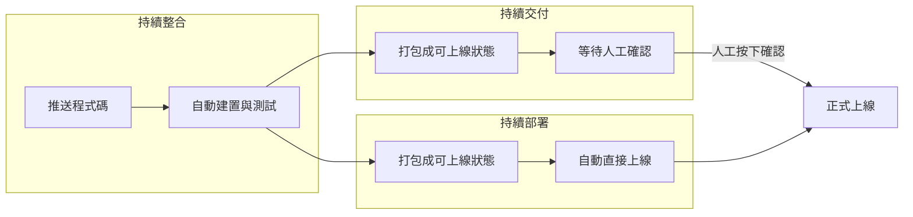

# 第 4 章:持續交付與持續部署(CD)

> CD 這個縮寫其實對應兩個相關但不完全相同的概念:Continuous Delivery(持續交付)
> 與 Continuous Deployment(持續部署)。這一章會把兩者講清楚。

---

## 4.1 從「檢查合格」到「送到使用者手上」

延續前一章的比喻:CI 就像品管檢查,確認飲料調配沒問題。
但光是「檢查合格」還不夠,飲料還得**真的交到客人手上**,客人才喝得到。

CD 負責的,就是「檢查合格之後,怎麼把成果送出去」這件事。

在軟體的世界裡,「送出去」代表把程式碼實際安裝、上線到使用者可以使用的環境
(例如把網站部署到伺服器上、把 App 更新推送到手機商店)。

---

## 4.2 持續交付(Continuous Delivery)

**持續交付**指的是:每次 CI 檢查通過後,系統會自動把程式打包成「隨時可以上線的狀態」,
但**實際要不要上線,由人來按下最後的確認按鈕**。

打個比方:

> 飲料已經調配好、品管也檢查通過、封口貼標也做好了,整杯飲料已經**隨時可以交給客人**。
> 但店長說:「先擺著,等我確認今天的促銷活動開始了,再拿出去賣。」

適合持續交付的情境:

- 上線時間需要配合特定時機(例如行銷活動、法規生效日)。
- 團隊希望有一個人工的「最後把關」,尤其是影響範圍很大的系統(例如銀行系統)。

---

## 4.3 持續部署(Continuous Deployment)

**持續部署**則更進一步:只要 CI 檢查通過,**系統會自動直接上線,完全不需要人工按確認**。

延續比喻:

> 飲料調配好、檢查通過,機器人手臂直接把飲料放到出餐口,完全不用店長點頭。

適合持續部署的情境:

- 功能改動通常範圍小、風險相對可控。
- 團隊對自己的自動化測試很有信心(測試覆蓋得夠完整,測試沒過才會被擋下來)。
- 想要盡可能縮短「寫完程式」到「使用者看到成果」之間的時間。

---

## 4.4 三者關係總覽

用一句話總結三者差異:

| 階段 | 自動化程度 | 一句話 |
|------|------------|--------|
| 持續整合(CI) | 自動建置 + 自動測試 | 「確認程式碼沒有壞掉」 |
| 持續交付(Continuous Delivery) | 自動打包到「可上線」狀態,人工決定何時上線 | 「隨時準備好,你說了算」 |
| 持續部署(Continuous Deployment) | 全自動,測試通過就直接上線 | 「測試過關,馬上讓大家看到」 |

---

## 4.5 本專案採用哪一種?

本專案的 [`examples/website`](../examples/website) 範例,搭配的是 [`.github/workflows/deploy.yml`](../.github/workflows/deploy.yml),
採用的是**持續部署**的做法:只要程式碼被合併進 `main` 分支,GitHub Actions 就會自動把網站部署到
GitHub Pages 上,完全不需要額外按確認按鈕。

之所以選擇這種做法,是因為:

- 這是一個教學用的靜態網站範例,風險很低,就算部署錯了也很容易復原。
- 可以讓你最直接地感受到「自動部署」的效果——推送程式碼後,幾分鐘內就能在網址上看到更新。

實際企業專案中,是否採用持續部署,通常會依照系統的風險程度、測試完整度、以及團隊文化來決定。

---

## 4.6 小結

- CI 負責「確認程式碼沒壞掉」。
- 持續交付負責「把程式碼準備好,隨時可以上線,但由人決定何時上線」。
- 持續部署負責「把程式碼準備好之後,自動直接上線」。
- 三者合在一起,就是我們常聽到的「CI/CD」。

概念都理解了之後,接下來要動手實作了。前往 [第 5 章:GitHub Actions 入門](./05-GitHubActions入門.md),
認識我們接下來會一直用到的工具。
