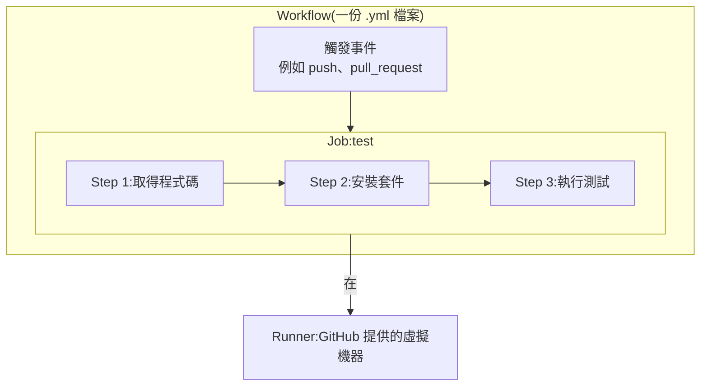

# 第 5 章:GitHub Actions 入門

> GitHub Actions 是 GitHub 內建的 CI/CD 工具,不需要額外安裝任何東西,
> 只要在你的 repo 裡放對一個設定檔,GitHub 就會幫你自動執行。這一章先認識幾個關鍵名詞。

---

## 5.1 GitHub Actions 是什麼?

簡單說:**GitHub Actions 讓你可以用一份文字設定檔,描述「當某件事發生時,要自動執行哪些步驟」。**

例如:「當有人推送程式碼時,自動幫我安裝套件、跑測試」,就是一份典型的 GitHub Actions 設定。

這份設定檔會被放在你的 repo 裡固定的位置:

```
.github/workflows/你自己取的名字.yml
```

只要檔案放在這個資料夾裡,GitHub 就會自動偵測並執行,不需要另外註冊或安裝任何軟體。

---

## 5.2 五個核心名詞

理解 GitHub Actions,只要先掌握這五個名詞就夠了:

### (1) Workflow(工作流程)

一份 `.yml` 設定檔,就是一個 workflow。它描述了「什麼時候要做」以及「要做什麼」。
本專案裡有兩個 workflow:[`ci.yml`](../.github/workflows/ci.yml) 跟 [`deploy.yml`](../.github/workflows/deploy.yml)。

### (2) Event(觸發事件)

決定「什麼時候」要執行這個 workflow,常見的觸發事件有:

| 事件名稱 | 白話說明 |
|----------|----------|
| `push` | 有人把程式碼推送到指定分支時 |
| `pull_request` | 有人開啟或更新 Pull Request 時 |
| `workflow_dispatch` | 有人在 GitHub 網頁上手動按下「執行」按鈕時 |
| `schedule` | 依照排定的時間週期性執行(像鬧鐘一樣) |

### (3) Job(工作)

一個 workflow 裡可以包含一個或多個 job,每個 job 代表「一整組要完成的任務」,
預設情況下不同的 job 會**同時平行執行**(除非你特別設定要它們按順序執行)。

### (4) Step(步驟)

一個 job 底下,會依照順序執行一連串的 step,例如「安裝套件」、「執行測試」都是各自獨立的 step。
step 是**依照寫的順序,一個接一個執行**的,前一步失敗,後面通常就不會繼續執行。

### (5) Runner(執行者)

實際負責執行這些 step 的「虛擬電腦」。GitHub 會提供全新、乾淨的虛擬機器來執行你的 workflow,
執行完畢後這台虛擬機器就會被銷毀,下一次執行會拿到一台全新的。
你可以在設定裡指定要用哪一種作業系統的虛擬機器,例如 `ubuntu-latest`(最常用)、`windows-latest`、`macos-latest`。

---

## 5.3 關係圖總覽



換句話說:**Workflow 由事件觸發,裡面包含一個或多個 Job,每個 Job 在一台 Runner 上,
依序執行一連串的 Step。**

---

## 5.4 YAML 格式快速上手

GitHub Actions 的設定檔使用 **YAML** 格式撰寫(副檔名 `.yml`)。YAML 的規則很簡單,
主要靠「縮排」來表示層級關係,類似大綱筆記:

```yaml
name: 這是 workflow 的名字      # 最外層

on: push                       # 觸發事件

jobs:                          # 底下可以有多個 job
  test:                        # 這個 job 的名字叫 test
    runs-on: ubuntu-latest     # 指定要用哪種虛擬機器
    steps:                     # 底下依序執行的步驟
      - name: 第一步
        run: echo "哈囉"
      - name: 第二步
        run: echo "這是第二步"
```

幾個要注意的小細節:

- YAML 對**縮排非常敏感**,同一層級的項目,前面的空白數量必須完全一致(通常用 2 個空白,不要用 Tab)。
- `#` 後面的文字是註解,不會被執行,純粹給人看的說明。
- `run:` 後面接的是實際要在終端機執行的指令(跟你平常在終端機打的指令一模一樣)。
- `uses:` 後面接的是別人已經寫好、可以直接拿來用的「現成步驟」(稱為 Action),
  例如 `actions/checkout@v4` 就是官方寫好、專門用來「取得程式碼」的現成步驟,不用自己重新發明。

---

## 5.5 小結

| 名詞 | 白話翻譯 |
|------|----------|
| Workflow | 一份完整的自動化流程設定檔 |
| Event | 觸發這份流程的時機 |
| Job | 一組任務,預設彼此平行執行 |
| Step | Job 裡面依序執行的小步驟 |
| Runner | 實際執行這些步驟的虛擬機器 |

有了這些基礎,接下來我們要對照本專案真實的 workflow 檔案,逐行拆解它的內容。
前往 [第 6 章:動手寫第一個 Workflow](./06-撰寫第一個workflow.md)。
