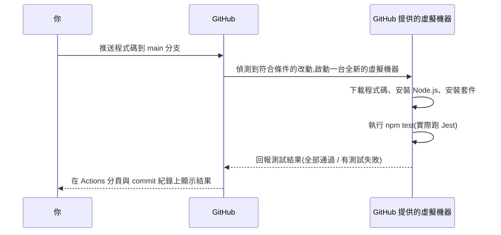

# 第 7 章:在 CI 裡面做自動測試

> 這一章搭配本專案真實的 [`examples/calculator`](../examples/calculator) 範例,
> 說明「自動測試」的程式碼實際上長什麼樣子、以及它是怎麼被自動觸發的。

---

## 7.1 測試在測試什麼?

測試程式,做的事情其實很單純:**執行一段程式碼,並且檢查結果是不是跟你預期的一樣。**

以本專案的計算機範例 [`src/calculator.js`](../examples/calculator/src/calculator.js) 為例,裡面有一個加法函式:

```javascript
function add(a, b) {
  return a + b;
}
```

我們可以寫一段測試,驗證「呼叫 `add(2, 3)`,結果應該要是 `5`」:

```javascript
test("加法:2 + 3 應該等於 5", () => {
  expect(add(2, 3)).toBe(5);
});
```

這段程式碼可以拆成三個部分理解:

| 部分 | 意思 |
|------|------|
| `test("...", () => { ... })` | 定義一個測試案例,字串是這個測試的說明文字 |
| `add(2, 3)` | 實際執行你想測試的功能 |
| `expect(...).toBe(5)` | 「預期」執行結果應該要等於 `5`,如果不是,這個測試就會失敗 |

本專案完整的測試檔案在 [`tests/calculator.test.js`](../examples/calculator/tests/calculator.test.js),
裡面總共寫了五個測試案例,涵蓋加法、減法、乘法、除法,以及「除以 0 應該要出現錯誤」這個特殊狀況。

> 我們使用的測試工具叫做 [Jest](https://jestjs.io/),是 JavaScript 生態系裡非常普及的測試框架。
> 不同程式語言會有各自常用的測試工具(例如 Python 常用 `pytest`),但核心概念都是一樣的:
> **執行程式碼,並且檢查結果是否符合預期。**

---

## 7.2 為什麼「除以 0」也要測試?

新手寫測試時,常常只測試「正常、順利的情況」,卻忘記測試「異常狀況」。

以計算機為例,數學上「除以 0」是沒有意義的,所以我們在程式裡加了防呆:

```javascript
function divide(a, b) {
  if (b === 0) {
    throw new Error("除數不能是 0");
  }
  return a / b;
}
```

對應的測試會驗證「這個防呆機制真的有生效」:

```javascript
test("除以 0 應該要丟出錯誤", () => {
  expect(() => divide(10, 0)).toThrow("除數不能是 0");
});
```

好的測試,不只驗證「正常情況會得到正確答案」,也要驗證「異常情況有被妥善處理」。
這正是自動化測試比人工檢查更可靠的地方——**它會逼你事先想清楚每一種可能發生的狀況**,
而不是等使用者真的遇到問題才發現。

---

## 7.3 CI 是怎麼「自動」執行這些測試的?

回顧 [第 6 章](./06-撰寫第一個workflow.md) 拆解過的 `ci.yml`,關鍵在最後兩個步驟:

```yaml
      - name: 安裝套件
        run: npm install

      - name: 執行測試
        run: npm test
```

`npm test` 這個指令,實際上是去讀取 [`package.json`](../examples/calculator/package.json) 裡的設定:

```json
{
  "scripts": {
    "test": "jest"
  }
}
```

也就是說,`npm test` 會實際去執行 `jest` 這個測試工具,而 Jest 會自動找出所有以 `.test.js` 結尾的檔案,
逐一執行裡面的每一個測試案例。

整個「自動」的過程,串起來就是:



整個過程完全不需要人工介入——你只需要專心寫好程式碼跟測試,剩下的自動化交給 CI 系統處理。

---

## 7.4 動手試試看:讓測試故意失敗

想更直觀地感受 CI 的作用,可以試著做這個實驗:

1. 打開 [`src/calculator.js`](../examples/calculator/src/calculator.js),
   故意把加法函式改錯,例如改成 `return a - b;`(把加法寫成減法)。
2. 推送這個修改到你自己 fork 出來的分支,或是開一個 Pull Request。
3. 前往 Actions 分頁,你會看到測試執行失敗,而且錯誤訊息會清楚告訴你:
   「預期 `add(2, 3)` 應該等於 `5`,但實際得到的結果是 `-1`」。
4. 把程式碼改回正確的 `return a + b;`,重新推送,測試就會恢復成功。

這個實驗清楚示範了 CI 的價值:**不用等到有人手動發現「加法功能壞了」,系統在幾十秒內就自動抓到問題。**

---

## 7.5 小結

- 測試程式的核心邏輯是:「執行程式碼」+「檢查結果是否符合預期」。
- 好的測試,除了驗證正常情況,也要驗證異常情況(例如除以 0)。
- CI 系統會在虛擬機器裡自動安裝好環境、自動執行測試指令,並把結果回報出來。

認識了「自動測試」之後,接下來要看「自動部署」的部分,搭配網站範例實際示範一次完整的部署流程。
前往 [第 8 章:自動部署到 GitHub Pages](./08-自動部署到GitHubPages.md)。
