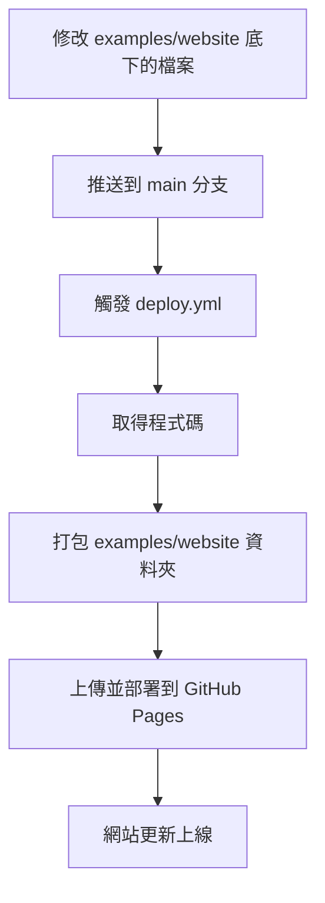

# 第 8 章:自動部署到 GitHub Pages

> 這一章搭配本專案真實的 [`examples/website`](../examples/website) 與
> [`.github/workflows/deploy.yml`](../.github/workflows/deploy.yml),說明「自動部署」實際上是怎麼運作的。
> 你可以直接打開 <https://flin1206.github.io/ci-cd-tutorial/> 看看部署後的成果。

---

## 8.1 什麼是 GitHub Pages?

GitHub Pages 是 GitHub 提供的**免費靜態網站託管服務**。「靜態網站」指的是像 HTML、CSS 這種
不需要伺服器額外運算、寫好什麼內容就顯示什麼內容的網站(相對於需要資料庫、會員系統的「動態網站」)。

只要把網站檔案(例如 `index.html`)交給 GitHub Pages,它就會自動幫你架設好一個網址,
讓任何人都可以透過網路瀏覽。這讓我們可以完全免費地示範「自動部署」這個概念,不需要額外租用伺服器。

---

## 8.2 部署流程總覽



從你按下推送的那一刻,到網站實際更新完成,整個過程通常只需要幾十秒到一兩分鐘,
完全不需要自己登入伺服器、上傳檔案。

---

## 8.3 逐段拆解 `deploy.yml`

```yaml
name: CD - 自動部署網站到 GitHub Pages

on:
  push:
    branches: ["main"]
    paths:
      - "examples/website/**"
      - ".github/workflows/deploy.yml"
  workflow_dispatch:
```

- 觸發條件跟 `ci.yml` 類似:當 `examples/website/` 資料夾的內容被推送到 `main` 分支時觸發。
- 多了一個 `workflow_dispatch`,這代表你也可以到 GitHub 網頁的 Actions 分頁,
  手動按下「Run workflow」按鈕,隨時重新觸發一次部署,不一定要靠推送程式碼來觸發。

```yaml
permissions:
  contents: read
  pages: write
  id-token: write
```

這一段是在告訴 GitHub:「這個 workflow 需要有『讀取程式碼』跟『寫入 GitHub Pages』的權限」。
GitHub Actions 預設的權限是比較保守的,凡是牽涉到「部署」這種有實際影響的動作,
都需要明確地在設定檔裡打開對應的權限,這是一種安全機制,避免 workflow 被誤用來做超出預期的事。

```yaml
concurrency:
  group: "pages"
  cancel-in-progress: true
```

這段是為了避免「同時有兩個部署流程互相搶著上線」的情況。如果你連續推送了兩次修改,
新的部署流程開始時,會自動取消還在進行中的舊部署流程,確保永遠是「最新的內容」被部署上去。

```yaml
jobs:
  deploy:
    name: 建置並部署網站
    runs-on: ubuntu-latest
    environment:
      name: github-pages
      url: ${{ steps.deployment.outputs.page_url }}
```

`environment` 這段設定,會讓這次部署的網址,直接顯示在 GitHub 網頁的執行紀錄上,
方便你部署完成後一鍵點擊查看成果,不用自己去記網址。

```yaml
    steps:
      - name: 取得程式碼
        uses: actions/checkout@v4

      - name: 設定 GitHub Pages
        uses: actions/configure-pages@v5

      - name: 打包網站內容
        uses: actions/upload-pages-artifact@v3
        with:
          path: examples/website

      - name: 部署到 GitHub Pages
        id: deployment
        uses: actions/deploy-pages@v4
```

四個步驟分別是:

1. **取得程式碼**:跟 CI 一樣,先把 repo 的內容下載到虛擬機器裡。
2. **設定 GitHub Pages**:準備好部署所需要的環境設定。
3. **打包網站內容**:把 `examples/website` 這個資料夾(裡面是 `index.html` 跟 `style.css`)
   打包成一份可以部署的檔案包。
4. **部署到 GitHub Pages**:把打包好的內容,正式發布到 GitHub Pages 上,這一步完成後,
   網站內容就正式更新了。

---

## 8.4 事前準備:啟用 GitHub Pages

要讓這個 workflow 真的能運作,repo 的設定裡必須先把 GitHub Pages 的來源設定為「GitHub Actions」
(而不是預設的「從某個分支的資料夾讀取檔案」),本專案已經事先完成這項設定
(路徑:repo 的 Settings → Pages → Build and deployment → Source 選擇 GitHub Actions)。

如果你之後自己建立新的專案,想套用一樣的部署方式,記得要先手動做這一步設定,
`deploy.yml` 才有辦法正常運作。

---

## 8.5 動手試試看:修改網站內容並觀察自動部署

1. 打開 [`examples/website/index.html`](../examples/website/index.html),
   把裡面「目前部署版本說明文字」後面的文字改成你自己想寫的內容。
2. 推送這個修改到 `main` 分支(或先開 Pull Request,合併後才會真正觸發部署)。
3. 前往 [Actions 分頁](https://github.com/flin1206/ci-cd-tutorial/actions),
   觀察「CD - 自動部署網站到 GitHub Pages」這個 workflow 執行的過程。
4. 執行完成後,重新整理 <https://flin1206.github.io/ci-cd-tutorial/>,
   你會看到網站內容已經變成你剛剛修改的文字。

整個過程,你完全不需要手動連線到任何伺服器、也不需要手動上傳任何檔案。

---

## 8.6 小結

- GitHub Pages 讓我們可以免費、真實地示範「自動部署」這個概念。
- `permissions` 設定是 GitHub Actions 的安全機制,部署類的操作需要明確授權。
- `concurrency` 設定避免多次部署互相衝突。
- 完整流程:取得程式碼 → 打包網站內容 → 部署 → 網站更新上線,全程自動化。

到這裡,你已經完整理解了一個 CI/CD 系統從「自動測試」到「自動部署」的完整運作方式。
接下來看看業界實際採用 CI/CD 時,有哪些值得注意的最佳實踐。前往
[第 9 章:最佳實踐與常見錯誤](./09-最佳實踐與常見錯誤.md)。
